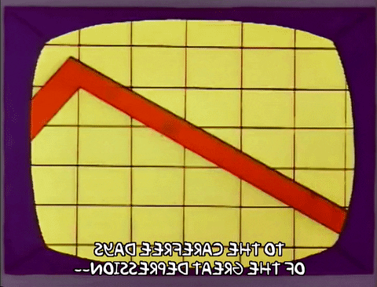
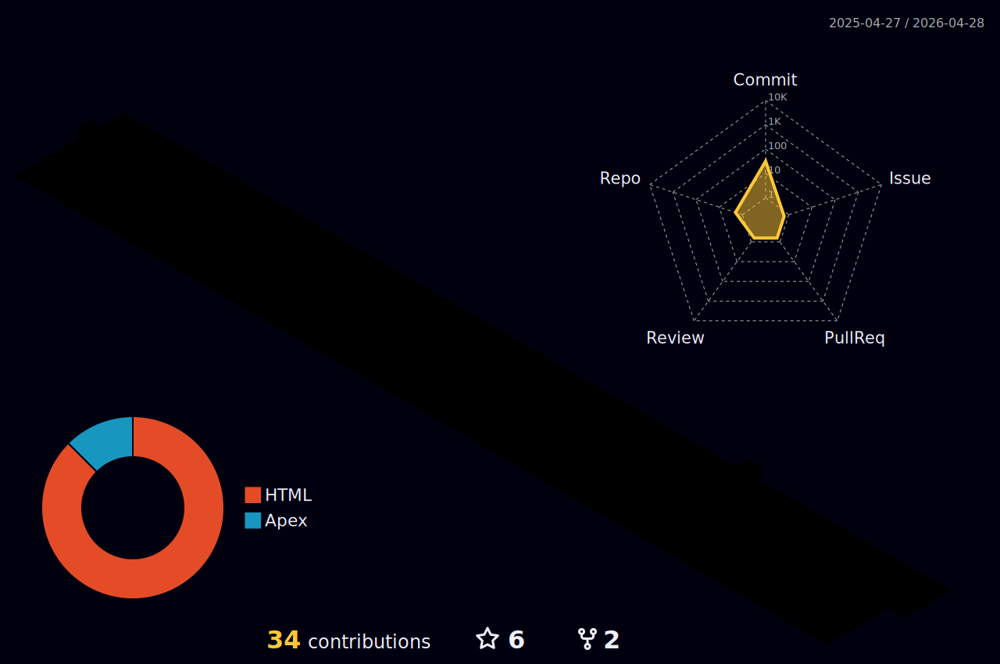

<h1 align="center"> Olá, me chamo Lucas </h1>
<h3 align="center"></h3>

<div align="center">
    
  
  
  <!---->
  
  
  
  
</div>

<div align ="center"></div>

## ↪️ __Linguagens__ e __Ferramentas__   ➡️🔄<font size=1> _No momento estudo e uso_</font><font size=4> ⤵️</font>


```js
const fundamentals = {        const databases = {           var languages = {          let tools = {
  "html", "css", "js"           "mysql", "mongodb"            "node.js", "python", "java" "apex"        "npm", "yarn"
}                            }                               }                          }    
                  
let extras = [ "ts", "react", "postman"]
let knowledges = {...fundamentals, ...languages, ...tools, ...databases, ...extras}

readme.post("/readme", (req, res) => {
  knowledges = req.body;
    res.json({success: "Meus conhecimentos:"})}                
```
<div align="center">


[<h3>Total Time Coding:</h3>](https://wakatime.com/@bff3bd5b-d006-41a8-bba0-d0a9e7b9406a)
<p>
  <a href="https://www.linkedin.com/in/lucas-conceição-dos-santos-52481216b/">
    
  </a>
  <a href="mailto:lucas.cds1997@gmail.com">
    
  </a>
</p>
 
<div align="center">
  <h3 align="center" style="color: green;">O que estou escutando agora </h3>
    </img>
  </div>

</div>
<hr>
<h2 align="center"> Um pouco sobre mim </h2>


###
                                      🔭 Trabalhando como Dev Salesforce Trainee na Everymind 🔭
                                           🎓Formado em Segurança da Informação 2017-2019🎓
                             🎓 Ensinar é a melhora forma de aprender, tanto as outros como a si mesmo 🔑
                                        ❤️ Um dos meus hobbies preferidos é andar de skate 🛹
                                   🏃 Um desafio pessoal: Melhorar com as habilidades Front-End 👨‍💻 
                                  
                                          

<hr>

<h2 align="center">Minhas atividades</h2>

<p align="center">
<a href="https://github.com/DenverCoder1/github-readme-streak-stats">

</a>
  <a href="https://wakatime.com/@lcds97">
  
<a href="https://github.com/LCDS97?tab=repositories">
        
</a>

<a href="#">
  </a>
</p>
<!--<a href="https://github.com/lcds97/">
  
</a>

<a href="https://wakatime.com/@lcds97">
  
<a href="https://github.com/lcds97/">
  
</a> -->


<div align="center"></div>
<details align="center">
  <summary> <i>📈📊 Minhas métricas no 𝙶𝚒𝚝𝙷𝚞𝚋 📊📈</i> </summary>

<!--START_SECTION:waka-->


**🐱 My GitHub Data** 

> 🏆 8 Contributions in the Year 2023
 > 
> 📦 296.9 kB Used in GitHub's Storage 
 > 
> 🚫 Not Opted to Hire
 > 
> 📜 45 Public Repositories 
 > 
> 🔑 22 Private Repositories  
 > 
**I'm a Night 🦉** 

```text
🌞 Morning    42 commits     ██░░░░░░░░░░░░░░░░░░░░░░░   8.42% 
🌆 Daytime    140 commits    ███████░░░░░░░░░░░░░░░░░░   28.06% 
🌃 Evening    190 commits    █████████░░░░░░░░░░░░░░░░   38.08% 
🌙 Night      127 commits    ██████░░░░░░░░░░░░░░░░░░░   25.45%

```
📅 **I'm Most Productive on Sunday** 

```text
Monday       76 commits     ███░░░░░░░░░░░░░░░░░░░░░░   15.23% 
Tuesday      53 commits     ██░░░░░░░░░░░░░░░░░░░░░░░   10.62% 
Wednesday    47 commits     ██░░░░░░░░░░░░░░░░░░░░░░░   9.42% 
Thursday     58 commits     ███░░░░░░░░░░░░░░░░░░░░░░   11.62% 
Friday       29 commits     █░░░░░░░░░░░░░░░░░░░░░░░░   5.81% 
Saturday     98 commits     █████░░░░░░░░░░░░░░░░░░░░   19.64% 
Sunday       138 commits    ███████░░░░░░░░░░░░░░░░░░   27.66%

```


📊 **This Week I Spent My Time On** 

```text
⌚︎ Time Zone: America/Sao_Paulo

💬 Programming Languages: 
Other                    2 hrs 40 mins       ██████████░░░░░░░░░░░░░░░   41.66% 
Apex                     2 hrs 16 mins       █████████░░░░░░░░░░░░░░░░   35.57% 
JavaScript               48 mins             ███░░░░░░░░░░░░░░░░░░░░░░   12.62% 
CSV                      17 mins             █░░░░░░░░░░░░░░░░░░░░░░░░   4.44% 
HTML                     11 mins             ░░░░░░░░░░░░░░░░░░░░░░░░░   2.95%

🐱‍💻 Projects: 
intercement-hml          3 hrs 33 mins       ██████████████░░░░░░░░░░░   55.54% 
intercement-prd          58 mins             ███░░░░░░░░░░░░░░░░░░░░░░   15.19% 
lindt-hmlparcial         47 mins             ███░░░░░░░░░░░░░░░░░░░░░░   12.32% 
copa-stg                 35 mins             ██░░░░░░░░░░░░░░░░░░░░░░░   9.28% 
Churras-Case             15 mins             █░░░░░░░░░░░░░░░░░░░░░░░░   4.13%

```

**Timeline**

 


 Last Updated on 29/01/2023 18:42:43 UTC
<!--END_SECTION:waka-->
  
  
</details>



