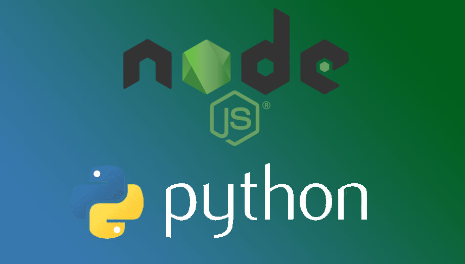

# Olá, me chamo Lucas

<pre style="text-align: center">
<h1> Desenvolvendor Back-End</h1>

Descobrindo um <b>novo mundo</b> através da área de <b>programação</b>

A cada dia me aperfeiçoando mais das novas tecnologias, atualmente estou procurando me focar em desenvolvimento back-end

meu objetivo é chegar rumo a full stack, sou apaixonado pelo mundo da segurança cibernética

</pre>

###
                                       🔭 Trabalhando na Veeva Systems como Analista de Dados 🔭
                                               Formado em Segurança da Informação 2017-2019
                                          👨‍💻👨‍💻 Ultimamente tenho focado em programar em: 👨‍💻👨‍💻

 

                                 

<!--
**LCDS97/LCDS97** is a ✨ _special_ ✨ repository because its `README.md` (this file) appears on your GitHub profile.

Here are some ideas to get you started:

- 🔭 I’m currently working on ...
- 🌱 I’m currently learning ...
- 👯 I’m looking to collaborate on ...
- 🤔 I’m looking for help with ...
- 💬 Ask me about ...
- 📫 How to reach me: ...
- 😄 Pronouns: ...
- ⚡ Fun fact: ...
-->
