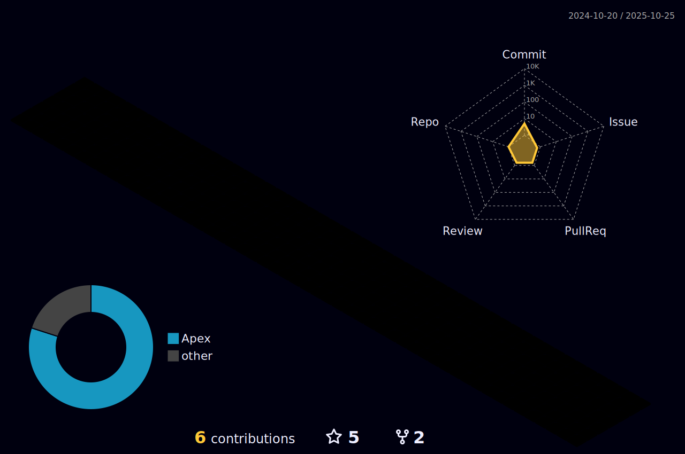

<h1 align="center"> Olá, me chamo Lucas </h1>
<h3 align="center"></h3>

<div align="center">
    
  
  
  <!---->
  
  
  
  
</div>

<div align ="center"></div>

## ↪️ __Linguagens__ e __Ferramentas__   ➡️🔄<font size=1> _No momento estudo e uso_</font><font size=4> ⤵️</font>


```js
const fundamentals = {        const databases = {           var languages = {          let tools = {
  "html", "css", "js"           "mysql", "mongodb"            "node.js", "python", "java" "apex"        "npm", "yarn"
}                            }                               }                          }    
                  
let extras = [ "ts", "react", "postman"]
let knowledges = {...fundamentals, ...languages, ...tools, ...databases, ...extras}

readme.post("/readme", (req, res) => {
  knowledges = req.body;
    res.json({success: "Meus conhecimentos:"})}                
```
<div align="center">


[<h3>Total Time Coding:</h3>](https://wakatime.com/@bff3bd5b-d006-41a8-bba0-d0a9e7b9406a)
<p>
  <a href="https://www.linkedin.com/in/lucas-conceição-dos-santos-52481216b/">
    
  </a>
  <a href="mailto:lucas.cds1997@gmail.com">
    
  </a>
</p>
 
<div align="center">
  <h3 align="center" style="color: green;">O que estou escutando agora </h3>
    </img>
  </div>

</div>
<hr>
<h2 align="center"> Um pouco sobre mim </h2>


###
                                      🔭 Trabalhando como Dev Salesforce Trainee na Everymind 🔭
                                           🎓Formado em Segurança da Informação 2017-2019🎓
                             🎓 Ensinar é a melhora forma de aprender, tanto as outros como a si mesmo 🔑
                                        ❤️ Um dos meus hobbies preferidos é andar de skate 🛹
                                   🏃 Um desafio pessoal: Melhorar com as habilidades Front-End 👨‍💻 
                                  
                                          

<hr>

<h2 align="center">Minhas atividades</h2>

<p align="center">
<a href="https://github.com/DenverCoder1/github-readme-streak-stats">

</a>
  <a href="https://wakatime.com/@lcds97">
  
</a>
<a href="#">
  </a>
</p>
<!--<a href="https://github.com/lcds97/">
  
</a>

<a href="https://wakatime.com/@lcds97">
  
<a href="https://github.com/lcds97/">
  
</a> -->


<div align="center"></div>
<details align="center">
  <summary> <i>📈📊 Minhas métricas no 𝙶𝚒𝚝𝙷𝚞𝚋 📊📈</i> </summary>

<!--START_SECTION:waka-->


**🐱 My GitHub Data** 

> 🏆 211 Contributions in the Year 2022
 > 
> 📦 205.7 kB Used in GitHub's Storage 
 > 
> 🚫 Not Opted to Hire
 > 
> 📜 39 Public Repositories 
 > 
> 🔑 20 Private Repositories  
 > 
**I'm a Night 🦉** 

```text
🌞 Morning    38 commits     █░░░░░░░░░░░░░░░░░░░░░░░░   6.35% 
🌆 Daytime    143 commits    ██████░░░░░░░░░░░░░░░░░░░   23.91% 
🌃 Evening    251 commits    ██████████░░░░░░░░░░░░░░░   41.97% 
🌙 Night      166 commits    ███████░░░░░░░░░░░░░░░░░░   27.76%

```
📅 **I'm Most Productive on Sunday** 

```text
Monday       85 commits     ███░░░░░░░░░░░░░░░░░░░░░░   14.21% 
Tuesday      82 commits     ███░░░░░░░░░░░░░░░░░░░░░░   13.71% 
Wednesday    64 commits     ██░░░░░░░░░░░░░░░░░░░░░░░   10.7% 
Thursday     73 commits     ███░░░░░░░░░░░░░░░░░░░░░░   12.21% 
Friday       39 commits     █░░░░░░░░░░░░░░░░░░░░░░░░   6.52% 
Saturday     113 commits    ████░░░░░░░░░░░░░░░░░░░░░   18.9% 
Sunday       142 commits    ██████░░░░░░░░░░░░░░░░░░░   23.75%

```


📊 **This Week I Spent My Time On** 

```text
⌚︎ Time Zone: America/Sao_Paulo

💬 Programming Languages: 
Apex                     24 hrs 44 mins      ████████████████████░░░░░   82.6% 
Other                    1 hr 25 mins        █░░░░░░░░░░░░░░░░░░░░░░░░   4.75% 
Markdown                 1 hr 23 mins        █░░░░░░░░░░░░░░░░░░░░░░░░   4.67% 
TypeScript               1 hr 22 mins        █░░░░░░░░░░░░░░░░░░░░░░░░   4.6% 
JSON                     38 mins             ░░░░░░░░░░░░░░░░░░░░░░░░░   2.15%

🐱‍💻 Projects: 
Apex-Best-Minds          26 hrs 22 mins      ██████████████████████░░░   88.04% 
TypeScript               2 hrs 53 mins       ██░░░░░░░░░░░░░░░░░░░░░░░   9.65% 
Unknown Project          24 mins             ░░░░░░░░░░░░░░░░░░░░░░░░░   1.35% 
Best Minds Logica de Prog8 mins              ░░░░░░░░░░░░░░░░░░░░░░░░░   0.49% 
Ursa Major Solar         3 mins              ░░░░░░░░░░░░░░░░░░░░░░░░░   0.21%

```

**Timeline**

 


 Last Updated on 30/04/2022 18:54:19 UTC
<!--END_SECTION:waka-->
  
  
</details>



